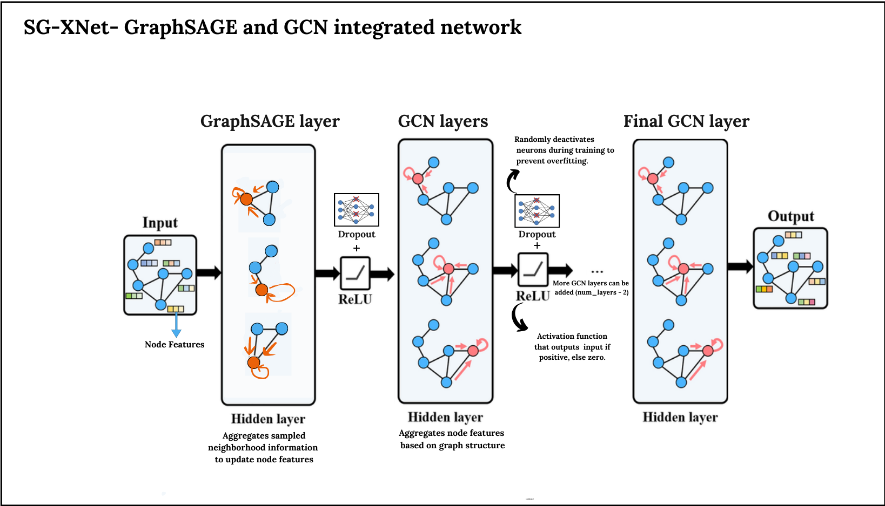

# SG-XNet
__Applying and comparing transfer learning techniques on different GNNs for Node Classification tasks__.
__Proposing a Hybrid model based on GraphSAGE and GCN integration, Called SG-XNet__.

