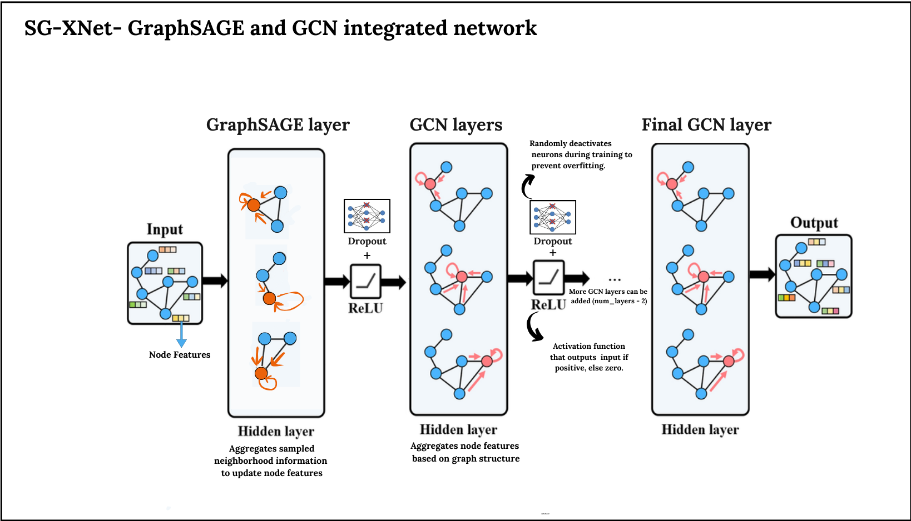

# SG-XNet
Applying transfer learning techniques like fine tuning, feature extractions to different GNN models to observe the performance gain compared to baseline methods. And implementing a new hybrid model SG-XNet

